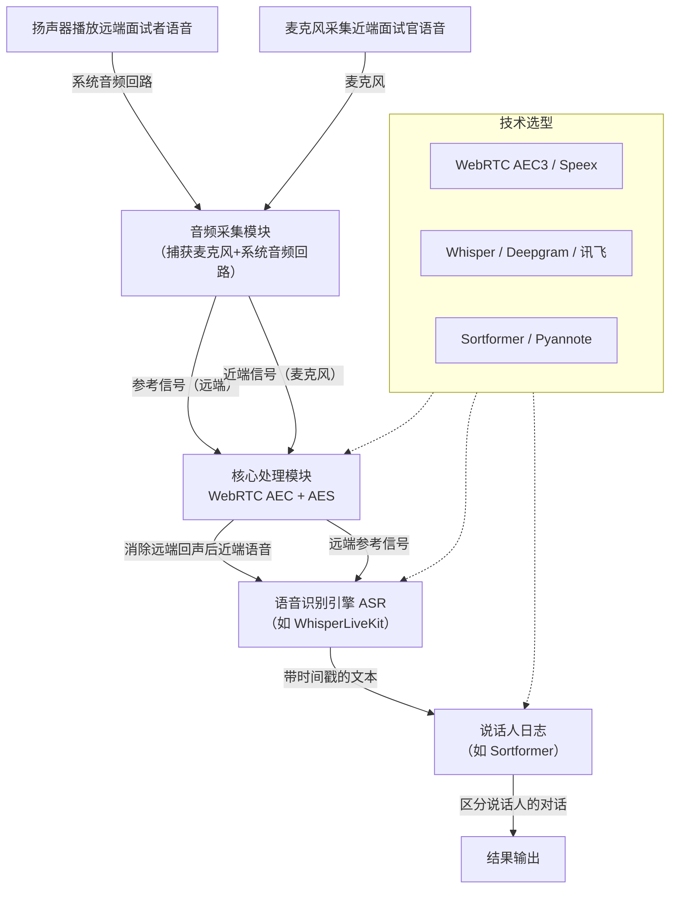

在不戴耳机的情况下，方案核心就变成了 **“软件定义的单通道音频”** 。我们将依赖算法，将混合的音频信号处理成两路逻辑上独立的音频流。

下面这个架构图直观地展示了整个处理流程：

要实现这个架构，需要攻克 **3个核心环节**，这里为你提供对应的技术选型分析。

### 🧩 第一步：音频采集与获取双通道音频

这是所有后续处理的基础。你需要确保同时获得两路独立的音频流：
*   **面试官音频**：通过本地麦克风直接录制。
*   **面试者音频**：从扬声器播放出来，需要通过**系统音频回路（Loopback）**捕获。

**具体步骤如下：**
1.  **配置音频硬件**：为面试官配备外接麦克风（如全向麦）。确保面试官的声音在物理上占据主导。
2.  **系统音频回路捕获**：这是获取纯净面试者语音的关键。
    *   **技术依赖**：在Windows上依赖WASAPI，在macOS上需要BlackHole等虚拟声卡。
    *   **Web端方案**：若开发Web应用，可使用`getDisplayMedia` API来捕获系统音频流。

### 🧪 第二步：声学回声消除（AEC）

这是**整个方案中最核心、最技术难点的一环**。目的就是解决：本地麦克风会在收录面试官声音的同时，也把扬声器里面试者的声音录进去，形成回声和混淆。

**技术选型指南：**

| 技术/工具 | 适用场景 | 优势 | 劣势 | 推荐指数 |
| :--- | :--- | :--- | :--- | :--- |
| **WebRTC AEC3** | 桌面级高性能应用，**推荐首选** | 高质量，延迟极低，成熟稳定，是业界的“金标准”（基准） | 计算开销相对AECm高，对设备有一定要求 | ★★★★★ |
| **WebRTC AECm** | 移动端或低功耗设备 | 专为移动设备优化，计算开销低 | 质量逊于AEC3，在大音量或复杂环境下回声消除不彻底 | ★★★★☆ |
| **Speex** | 嵌入式或对体积要求严格的场景 | 轻量、开源、广泛应用 | 在“双讲”等高要求场景下效果不佳，容易吞字或语音断续 | ★★★☆☆ |
| **Meta Beryl** | **理想技术方案** | 轻量级，效果出色，理论上能完美解决“双讲”问题 | **代码未完全开放，对开发者来说更像一个理想的技术方向** | ★★★★☆（作为技术方向参考） |

**如何实现：**
为了快速上手并保证效果，**强烈建议首选WebRTC AEC3算法**。你可以将其集成到你的应用程序中。

1.  **调用WebRTC库**：你可以使用如`aec3` (Rust) 等开源库，它能将原始的AEC3算法包装成易用的API。
2.  **输入参数**：AEC算法需要两个输入：
    *   **近端信号**：从麦克风捕获的混合音频。
    *   **远端参考信号**：从系统音频回路捕获的、纯净的面试者音频。
3.  **处理与输出**：AEC算法会将远端参考信号从近端信号中“减去”，输出消除回声后的、**极其纯净的面试官近端语音**。

### 🚀 第三步：并行引擎驱动转写与分离

准备好纯净的双路音频后，就可以让ASR和Speaker Diarization引擎为你工作了。

#### 语音识别引擎 (ASR)
以下是当前主流的实时语音识别（ASR）引擎，你需要在延迟和准确率之间找到平衡点：

| 引擎 | WER (%) | 实时因子 (RTFx) | 流式延迟 | 优势 | 劣势 |
| :--- | :--- | :--- | :--- | :--- | :--- |
| **Whisper (Large V3)** | 约7.4 (英文) | 中等 | 相对较高 | 多语言支持最广（99+种），精度标杆 | 速度偏慢，资源占用高，流式支持不如专用模型 |
| **Deepgram Nova-2** | 约3-4 (英文)| 快 | **<300ms** | 速度极快，准确率高，专为实时应用优化 | 商业云服务，有成本 |
| **Google STT (Chirp 2)** | 约3-4 (英文)| 中等 | 300-500ms | 准确率高，与Google生态集成好，含说话人日志功能 | 商业云服务，不同语言支持不一 |
| **讯飞/阿里等中文引擎** | 4-6 (中文)| 快 | 200-300ms | **中文场景深度优化**，生态完善 | 商业云服务，中英混合场景可能较弱 |
| **Parakeet TDT** | 约8.0 (英文) | **极快 (>2000)** | **极低** | 开源，为超低延迟流式而生的新模型 | 模型较新，生态和社区成熟度不如Whisper |

**选型建议**：如果面试以中文为主，优先考虑**阿里FunASR**或**讯飞**；如果对实时性要求极高且可接受商业服务，**Deepgram**是标杆级选择；如果追求开源和隐私保护，则选择**Whisper**或**Parakeet**。

#### 说话人分离引擎 (Speaker Diarization)
尽管双通道音频已降低分离难度，但加入说话人分离引擎是保证稳定可靠的“双保险”。

以下是3种主流的技术思路对比：

| 技术/工具 | 实时性 | 准确率 | 资源需求 | 适用场景 | 推荐指数 |
| :--- | :--- | :--- | :--- | :--- | :--- |
| **Sortformer** | **极高 (<200ms**) | **极高 (95%+**) | 中 (推荐GPU) | **需要极低延迟的实时交互应用，是首选方案** | ★★★★★ |
| **Pyannote** | 低 (秒级) | 高 (约94%) | 中 (CPU可用) | 对实时性要求不高、允许秒级延迟的后处理或离线分析场景 | ★★★★☆ |
| **传统聚类方法** (如Kaldi-based) | 低 (离线批处理) | 中上 (约92%) | 低至高 | 学术研究或对延迟无要求的离线数据分析 | ★★★☆☆ |

**方案建议**：对于你的实时面试系统，**Sortformer**是唯一能满足“实时对话”要求的选择。其他方案较高的延迟会让你精心设计的AEC和ASR失去意义。

### 💎 总结与实施清单

要实现这个方案，你需要完成以下步骤：

1.  **硬件准备**：为面试官配备一个优质麦克风，并**将扬声器音量控制在适中水平**，这能极大减轻AEC的负担。
2.  **实现音频回路**：在你的应用（桌面或Web）中，成功捕获两路独立的音频流，这是AEC的前提。
3.  **集成AEC模块**：在你的音频处理管线中，优先选择并集成**WebRTC AEC3**算法，将远端信号作为参考，对近端信号进行“清洗”。
4.  **部署AI模型**：
    *   **ASR**：根据你的语言需求和对延迟、成本的考量，选用上文推荐的一个或多个引擎。
    *   **Speaker Diarization**：集成**Sortformer**，处理ASR输出的带时间戳文本，为每个句子精确打上 `[面试官]` 和 `[面试者]` 标签。
5.  **系统测试与调优**：在真实环境中反复测试，重点处理**双讲（同时说话）** 场景，微调AEC、ASR和Diarization的参数，直至达到满意的效果。